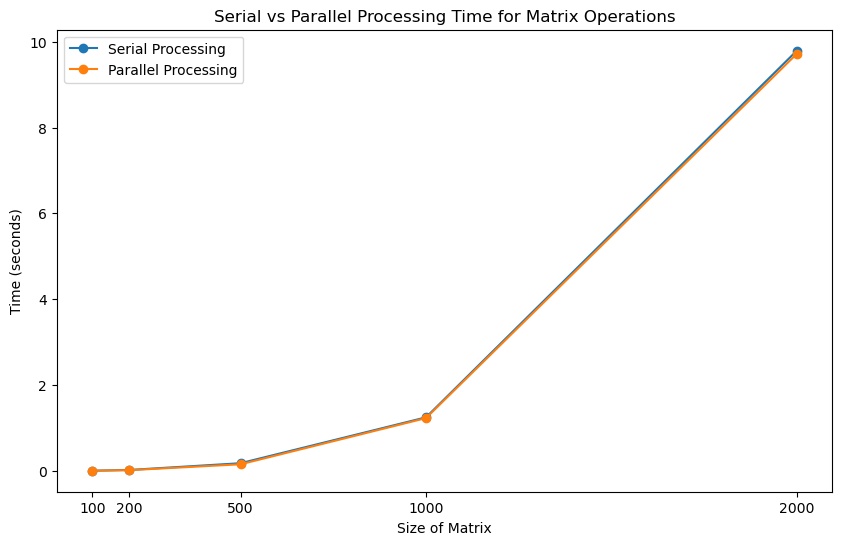
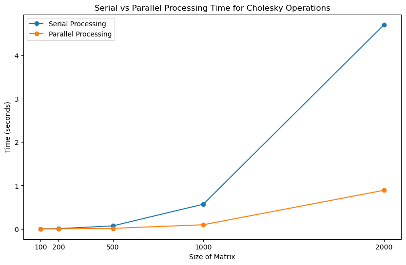
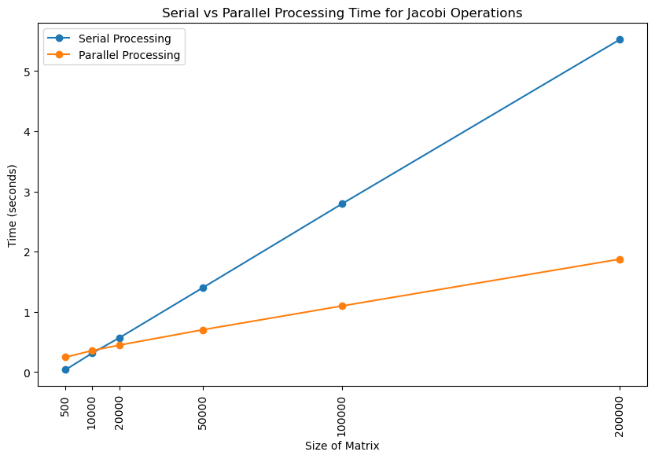

## Parallel Processing to Solve Linear Equations

This explores the use of OpenMP framework to parallize some of the steps (using OpenMP) in the three most common and popular linear equation solvers

1. Gaussian Elimination
2. Cholesky Decomposition
3. Jacobi Method

The performance gain using prallelization vs traditional serial approach for each method wrt to the size of matrix (linear equatiosn represented in matrix form)

1. Gaussian Elimination

2. Cholesky Decomposition

3. Jacobi Method

